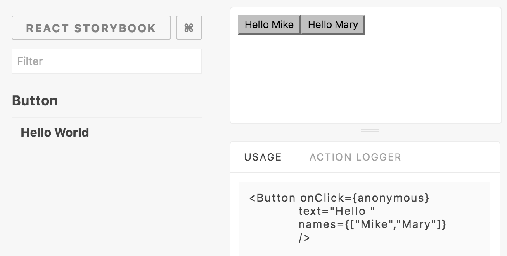

# Storybook Usage Addon

This addon let you display the story's declaration inside
a panel.



## Getting Started

First, install the addon

```shell
npm install -D storybook-addon-usage
```

Add this line to your `addons.js` file (create this file inside your storybook config directory if needed).

```js
import 'storybook-addon-usage/register';
```


Add those lines to your storybook config file

```js
import {Usage} from 'storybook-addon-usage'
storybook.addDecorator(Usage);
```
